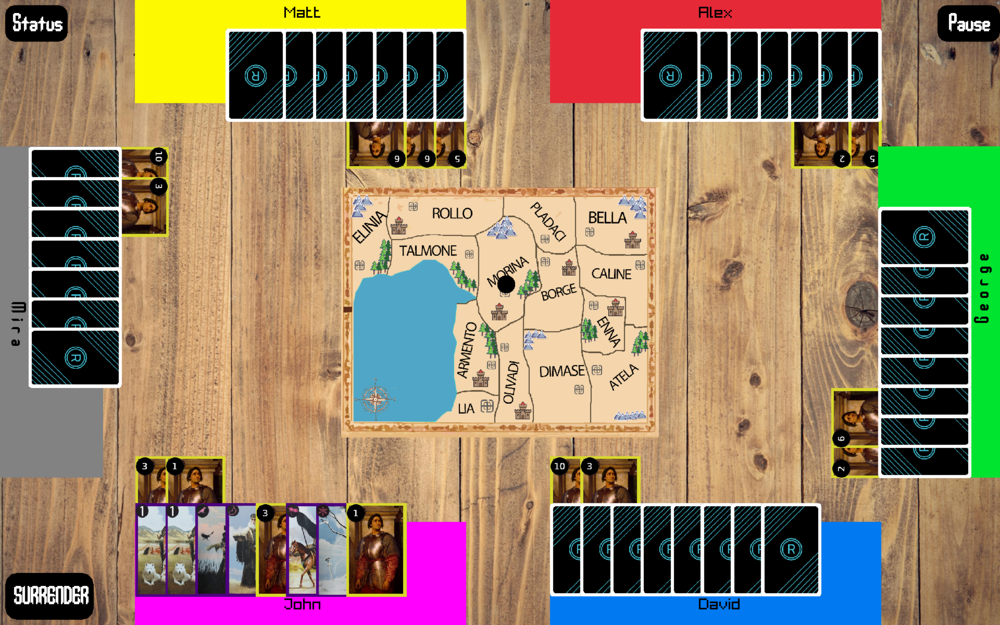

# condot

> [!NOTE]
> Play the live demo at
> [utilyre.github.io/condot](https://utilyre.github.io/condot).
>
> Make sure to zoom out your browser if the game appears too large.

During the Renaissance Era, Italy was divided into numerous independent
city-states. While bursting with trade and wealth, the city-states' growing
concern over jealous neighbors invited the rise of the Condottieri, ambitious
leaders of powerful mercenary armies.

In Condottiere, 3-6 players vie to establish their influence and control over
the cities and regions of Italy. Fight with skill and daring and use every tool
at your disposal to reshape the political and military landscape of Italy for
generations to come.

condot is an implementation of
[Condottiere](https://boardgamegeek.com/boardgame/112/condottiere) written in
C++ with [Raylib](https://raylib.com) and [OOP design](./docs/v2.pdf).


> _View the [full gallery](./gallery)_

## How to Build

### Linux x86_64

To build the project for **Linux x86_64** targets, follow the steps below:

1. Install the [development dependencies required by
   Raylib](https://github.com/raysan5/raylib/wiki/Working-on-GNU-Linux#dependencies).

2. Generate build configurations and build the project:

   ```bash
   cmake -B build
   cmake --build build
   ```

   Make sure all dependencies are correctly installed before running `cmake`.
   The build system will compile the source files and place the output binary
   in the `./build/` directory.

3. Launch the game:

   ```bash
   ./build/condot
   ```

## How to Play

See [docs/rules.pdf](./docs/rules.pdf).

## License

This project is licensed under the [MIT license](./LICENSE), except for
[docs/rules.pdf](./docs/rules.pdf) which has its own licensing.
